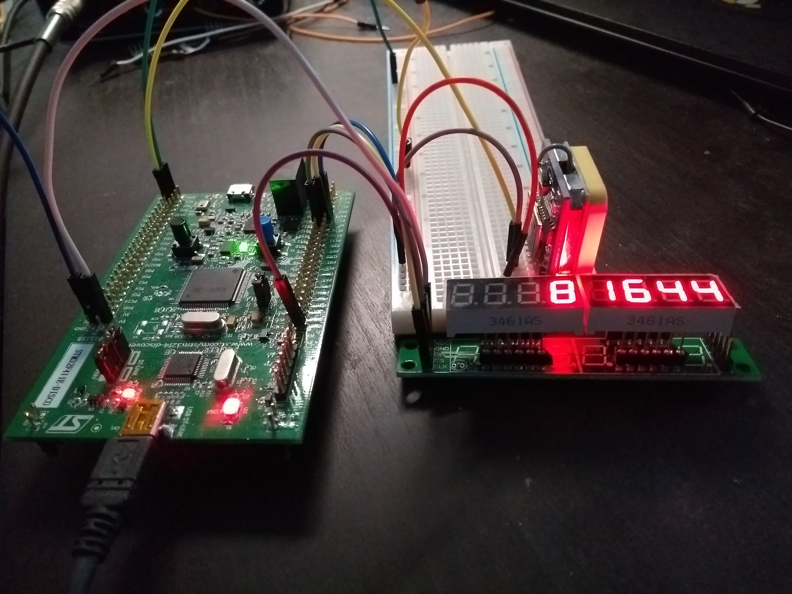
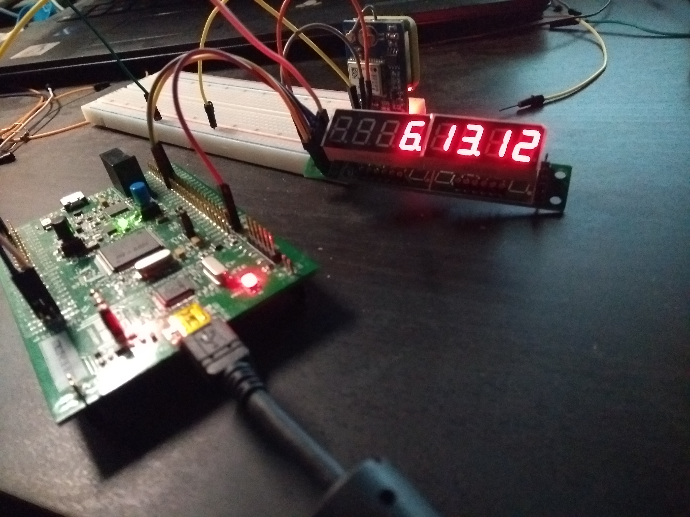

# SPI_GPSTime_STM32F4
Extracts time from GPS module and displays it over a 7 segment serial Display 
interfaced via SPI.

This project uses USART6 to receive GPS data, USART6 is used via DMA, 
such that an interrupt is generated after reception of 384 bytes from the GPS module.
The USART config is 9600-8-N-1

The Serial Seven Segment Display is connected to the SPI lines of the STM32F4 board.
SPI2 is configured and used in this project. 

Master      _  Slave
PB12(NSS)  -->  /CS
PB13(SCK)  -->  CLK
PB15(MOSI) -->  DIN

